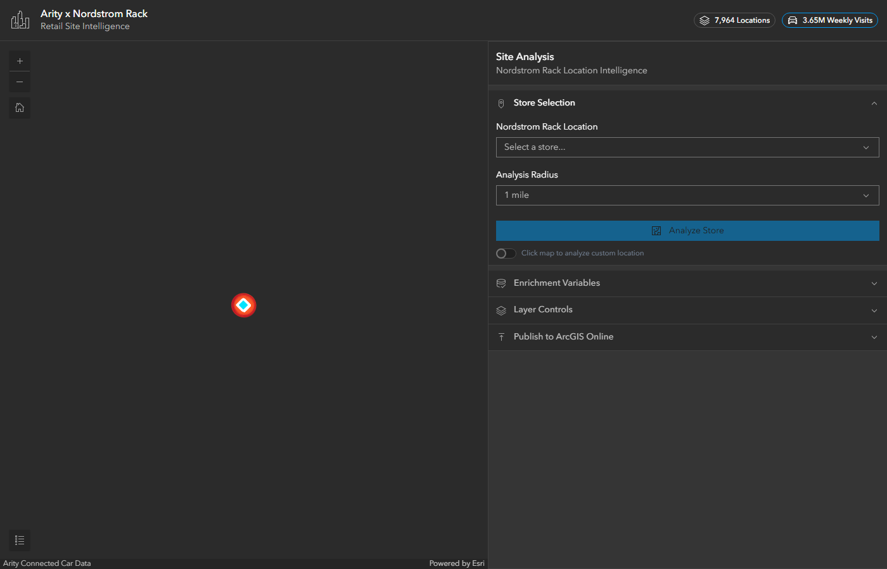

# Arity x Nordstrom Rack | Retail Site Intelligence

A production-grade ArcGIS JavaScript API application that leverages **Arity connected car movement data** to power retail site analysis for **Nordstrom Rack** stores across the Greater Los Angeles metropolitan area.

**[Live Demo](https://garridolecca.github.io/Esri_Arity_App/)**

**[ArcGIS Online Feature Service](https://www.arcgis.com/home/item.html?id=8a8f305def4c427bb674f21a5d8519f9)**



## Two Ways to Launch

| Mode | What You Need | Demographics | Basemap |
|------|--------------|-------------|---------|
| **Live Mode** | ArcGIS API Key | Real GeoEnrichment data | ArcGIS Dark Gray Vector |
| **Demo Mode** | Nothing | Realistic simulated data | CartoDB Dark Matter (free) |

Click **"Explore with Demo Data"** on the splash screen to try the full app instantly with no API key. All Arity traffic data is real; only the demographic enrichment is simulated.

## What This App Does

This application demonstrates how connected car mobility data can transform retail site selection and competitive analysis. It combines three data sources in real-time:

1. **Arity Connected Car Data** - 7,964 locations, 186 brands, 3.65M weekly visits across LA metro
2. **20 Nordstrom Rack Store Locations** - Verified locations across LA, Orange County, Inland Empire, and Ventura County
3. **ArcGIS GeoEnrichment** - Demographics, income, consumer spending, daytime population, and housing data (or simulated equivalents in Demo Mode)

## Key Features

### Graduated Symbology
- Point size scales by total weekly visits (4px to 28px)
- Color ramp from cool blue (low traffic) through yellow to deep red (high traffic)
- Opacity tied to visit volume for natural visual hierarchy

### Site Analysis Engine
- Select any Nordstrom Rack store or click anywhere on the map
- Configurable analysis radius (0.5 - 5 miles)
- Geodesic buffer with dashed cyan outline
- Parallel execution of GeoEnrichment + spatial Arity data queries

### Composite Site Score (0-100)
- **Traffic Score (35%)** - Total Arity visits within the analysis radius
- **Affluence Score (35%)** - Median household income relative to $120K benchmark
- **Market Score (30%)** - Population density relative to 150K benchmark
- Animated circular gauge + component bar charts

### GeoEnrichment Integration
- User enters their own ArcGIS API Key
- Configurable variable categories: Demographics, Income, Spending, Daytime Pop, Housing
- Custom variable input (e.g., `KeyUSFacts.DIVINDX_CY`)
- Results displayed as stat cards with formatted values

### Traffic Intelligence
- Total visits and location count within radius
- Top 8 brands ranked by traffic volume (horizontal bar chart)
- Category mix breakdown (Restaurants vs Hardware)

### Strategic Insights
- Rule-based recommendations generated from analysis results
- Income alignment, traffic density, commercial corridor density, population size
- Daytime population surge detection (employment center identification)
- Overall site verdict with score-based recommendation

### Additional Features
- Heatmap toggle (purple-to-red thermal visualization)
- Layer visibility controls
- Toggle between local GeoJSON and ArcGIS Online hosted layer
- In-app publishing to ArcGIS Online (enter AGOL credentials in the UI)
- Click-to-analyze custom locations
- Dark analytics theme with Calcite Design System

## Data

| Metric | Value |
|--------|-------|
| Locations | 7,964 unique places |
| Brands | 186 |
| Total Weekly Visits | 3,654,470 |
| Date Range | Feb 1-7, 2026 |
| Categories | Limited-Service Restaurants, Hardware Stores |
| Coverage | Greater LA, Orange County, Inland Empire, Ventura County |
| Geographic Extent | Lat 33.42-34.62, Lon -119.30 to -117.00 |

## Technology Stack

- **ArcGIS Maps SDK for JavaScript 4.30** (AMD modules)
- **Calcite Design System** (dark theme, web components)
- **ArcGIS GeoEnrichment REST API** (KeyUSFacts data collection)
- **GeoJSONLayer** with visual variables (size, color, opacity)
- **Client-side spatial queries** via `geometryEngine.geodesicBuffer`
- Single HTML file, zero build step

## Getting Started

### Prerequisites
- An [ArcGIS Developer](https://developers.arcgis.com/) API key with:
  - Basemap privileges
  - GeoEnrichment privileges (`premium:user:geoenrichment`)

### Run Locally
```bash
# Clone the repo
git clone https://github.com/garridolecca/Esri_Arity_App.git
cd Esri_Arity_App

# Start a local server (required for GeoJSON loading)
python -m http.server 9090

# Open http://localhost:9090 in your browser
# Enter your ArcGIS API key and click Launch
```

### Publish to ArcGIS Online
The app includes an in-app publishing panel. Or use the standalone script:
```bash
python publish_to_agol.py
```

## File Structure

```
Esri_Arity_App/
  index.html              # Main application (single file)
  data/
    arity_visits.geojson   # Aggregated visit data (7,964 features)
  aggregate_data.py        # CSV to GeoJSON aggregation script
  publish_to_agol.py       # Standalone AGOL publishing script
  do_publish.py            # REST API publishing script
  test_app.mjs             # Playwright automated test suite
```

## Nordstrom Rack Locations (20 stores)

Downtown LA, Beverly Connection, Culver City, Burbank, Glendale, Pasadena, North Hollywood, Woodland Hills, Porter Ranch, Northridge, Redondo Beach, West Covina, Orange, Anaheim Hills, Brea, Tustin, Laguna Hills, Chino, Oxnard, Tarzana

## Use Case Narrative

A Nordstrom Rack regional manager wants to optimize their LA store network. Using this app, they can:

1. **Evaluate existing stores** - See real vehicular traffic patterns around each location
2. **Identify expansion opportunities** - Click anywhere to evaluate untapped high-traffic areas
3. **Understand the market** - GeoEnrichment reveals income, demographics, and spending power
4. **Assess competitive landscape** - See which restaurant and hardware chains draw traffic nearby
5. **Make data-driven decisions** - Composite site scores combine traffic, affluence, and market size

---

Built with ArcGIS Maps SDK for JavaScript | Powered by Arity Connected Car Data
